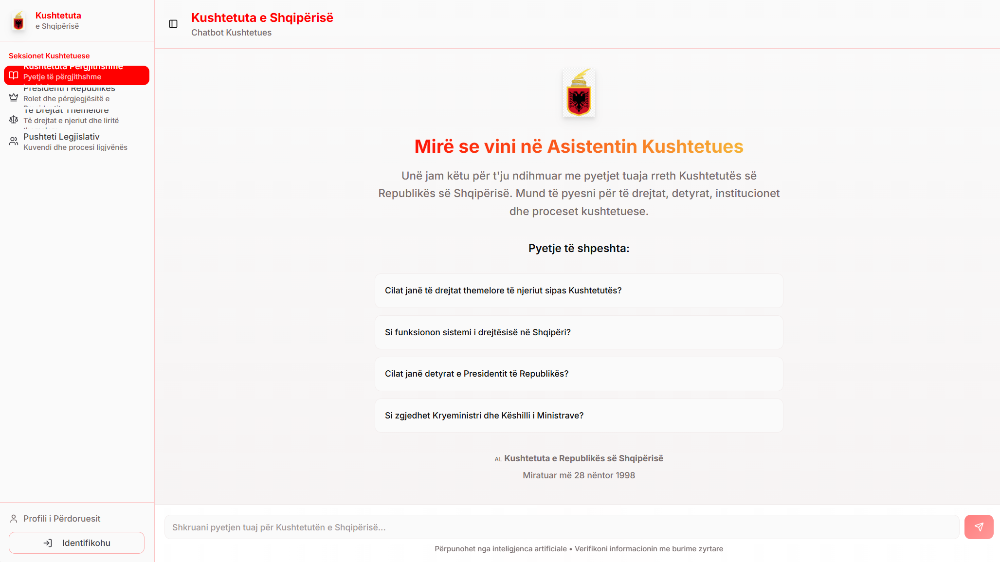

# Pyet Avokatin

## Description

This is the Pyet Avokatin project. It includes a frontend application built with modern web technologies.

## Features

- Feature 1
- Feature 2

## Installation

1. Clone the repository.
2. Navigate to the frontend directory.
3. Run `npm install`.
4. Run `npm start`.

## Usage

Describe how to use the application.

## Contributing

Guidelines for contributing.

## License

Specify the license.